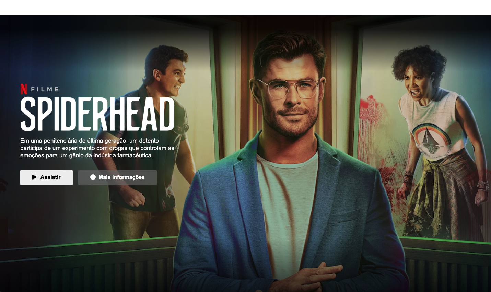
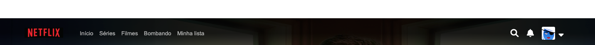
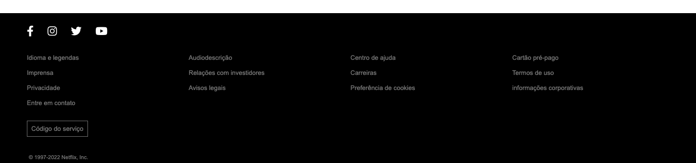

<h1 align="center" id="project_name">
   
  
   
  Clone Netflix
   
</h1>

Esse projeto foi desenvolvido através do Desafio #7DaysOfCode (Alura)

  

<h4 align="center">
  	🚧 Clone Netflix | Concluído 🚧
</h4>

<h2 id="about">
💻 Sobre o projeto
</h2>
Como estudantes autodidatas de programação, chega um momento em que percebemos que estamos estagnados nos estudos. Ao perceber isso decidi buscar formas de me desafiar. Soube do 7 Days of code através de um podcast com a Giulia Bordignon (@spacecoding).
Esse projeto é uma iniciativa da Alura, que consiste em desafios de várias áreas da programação como front-end, back-end, mobile, dados, etc.
 
Nele é dividido um projeto em 7 dias, em cada dia será feito um passo do projeto. Ótimo para praticar, se desafiar e ainda criar portifólio. Tudo de forma gratuita!
 
O desafio que escolhi foi para desenvolver uma página clone da Netflix, com foco apenas no HTML e CSS básicos ministrado pela Fernanda Degolin. Cada desafio possui o profissional que estará à frente daquele projeto.

 

Saiba mais aqui -->  **[7DaysOfCode](https://7daysofcode.io/)**

<h2 id="layout">🎨 Layout</h2>
O layout da aplicação está disponível no Figma:
  
<a href="https://empresas.alura.com.br/e3t/Ctc/I8+113/d2z6gD04/VVXdS15m02p6W27rd4L1BFyhjW3Dl4Sm53nBkmN3S9PHq3lYMRW7Y8-PT6lZ3mwW7_WNs_3t5KY2W3rSqF02S-Qy6V7jQm77St89qN5Csyz6Pv0TqW5TfdLb8wPqxFN8B3nZ_kXcSgW8VnJ3y943wJ7N7QQvFXZRKLGW5FT7JJ1ww6n6W4j7-Yc65fsQvW1bpZ286jtRnwW6vsD1R6gCV14W3DslqM2k3KGhW1QQf579ksMxqW6y1yNF2nNPr-N2l6VWwjl0vDW2xVCkr7NlhY1W1chcpC8Zc9VXW6YnKJN2_zjHDW5WCFzr8RFvbVVB4-J26lHzcTW5gZDhn8bn7BjW4vm28d3GLbP8W8RKjnJ66gmcBW6J18qr8jX5dJW2CJJsH4GVMjjf8q4DnH04">
  " src="https://img.shields.io/badge/Acessar%20Layout%20-Figma-%235965E0">
</a>
  

  

  
  
  

  

  

 
<h2 id="technologies">🛠 Tecnologias</h2>

As seguintes ferramentas foram usadas na construção do projeto:

- **[HTML](https://exemplo.com)**
- **[CSS](https://exemplo.com)**

> Veja o arquivo [CloneNetflix-ByMaddu](https://maddusilva.github.io/clone-netflix/)

**Utilitários**

- Protótipo: **Figma** → **[Protótipo Clone Netflix](https://empresas.alura.com.br/e3t/Ctc/I8+113/d2z6gD04/VVXdS15m02p6W27rd4L1BFyhjW3Dl4Sm53nBkmN3S9PHq3lYMRW7Y8-PT6lZ3mwW7_WNs_3t5KY2W3rSqF02S-Qy6V7jQm77St89qN5Csyz6Pv0TqW5TfdLb8wPqxFN8B3nZ_kXcSgW8VnJ3y943wJ7N7QQvFXZRKLGW5FT7JJ1ww6n6W4j7-Yc65fsQvW1bpZ286jtRnwW6vsD1R6gCV14W3DslqM2k3KGhW1QQf579ksMxqW6y1yNF2nNPr-N2l6VWwjl0vDW2xVCkr7NlhY1W1chcpC8Zc9VXW6YnKJN2_zjHDW5WCFzr8RFvbVVB4-J26lHzcTW5gZDhn8bn7BjW4vm28d3GLbP8W8RKjnJ66gmcBW6J18qr8jX5dJW2CJJsH4GVMjjf8q4DnH04)**
- Editor: **[Visual Studio Code](https://code.visualstudio.com/)**
- Fontes: **font-family: inherit;** **font-family: Arial, Helvetica, sans-serif;**

<h2 id="author">🦸 Autor</h2>
<a href="#">

 <b> Maria Eduarda da Silva </b></a>

 <h2 id="author">Social</h2>
<a href="#">

 

 

*Made with love ♡ by Maddu* 👋🏽 [Entre em contato!](https://www.linkedin.com/in/maddusilvadev/)

